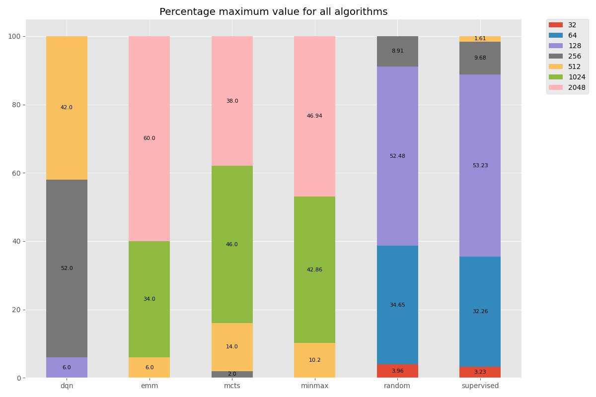
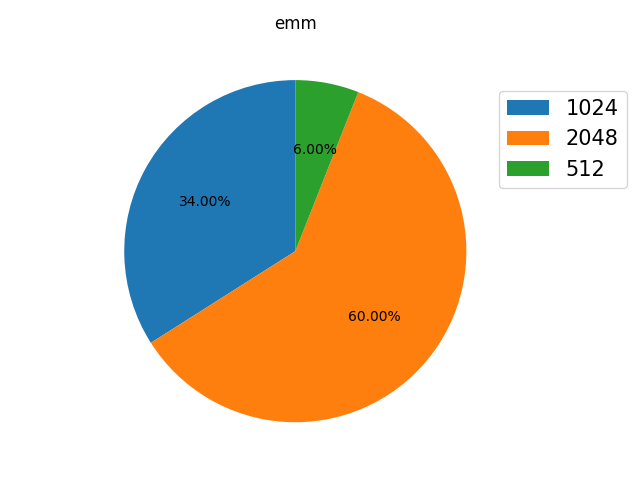

# AI Project S8 INSA - 2048

Implementation of the 2048 game logic and different AI algorithms in Python.

Our goal was to implement several algorithms and to compare them.

## Algorithms :

1. ### Minmax

   The minmax algorithm is used for games between opponents. To implement it, we consider two players: max and min. Max must maximize the score and corresponds to the player. He performs at each turn one of the 4 possible actions. Min corresponds to the computer that places a 2 or 4 on the grid each turn. It is not really an opponent, because it plays randomly but for this algorithm we considered it as an opponent and the results are interisting.
2. ### Deep Reinforcement Learning (DQN)

   Deep q-learning is a reinforcement learning algorithm that looks for the best action to take based on a current state. The expected reward of an action at a step is called Q-value. This is stored in a table for each state, future state tuple. We use neural networks in addition because it is complicated to track all the possible combinations of states. So instead of using only Q-values we approximate them with neural networks, which gives the Deep Q-Network, known as DQN.

   Our implementation is based on this one : https://github.com/SergioIommi/DQN-2048. We use our own environment based on all our algorithms. We also added the feature to provide the neural network with the n future states as input.
3. ### Expectimax

   TODO
4. ### Supervised Learning

   To develop supervised learning, we stored states and the associated action in memory during games in the file named *supervisedData.txt*.  This algorithm was developed before the DQN to discover more easily how to implement a neural network for the 2048 game. We quickly noticed that the results were not very good because we did not have enough data. That's why we decided to switch to reinforcement learning.
5. ### MCTS : Monte-Carlo Tree-Search

## Run an AI algorithm in the terminal or in web browser

All except DQN : 

```
python game_loop.py name_algo nb_games --remote

name_algo can be : 
- minmax
- mcts
- emm
- supervised

--remote is optional, it allows to launch the 2048 game directly online with the selected algorithm

--help : presents the different possibilities
```

DQN : 

```
cd DQN
python dqn2048.py

For train/test, change the value of the boolean TRAIN_TEST_MODE
```

## Results

Several scripts allow to visualize the results of the algorithms. To save the data, we used a .txt file for each algorithm in which we wrote for each game the maximum value reached and the score.

- The most general one allows to see for each algorithm the percentage to reach each value :



To launch it : 

```
python statistics.py histo
```


- The following table shows the evolution of each algorithm over 50 games :

  

To launch it :

```
python statistics.py graph
```


- A script allows to visualize the results for each algorithm individually :

```console
----------------------------------------------------------------------------------------------------
Results algorithm : emm | Number of games :  50
----------------------------------------------------------------------------------------------------
Max Tile reached : 2048
Maximum Tile Mean : 1607.68
----------------------------------------------------------------------------------------------------
Score Max reached : 36152
Score Mean : 23256.24
----------------------------------------------------------------------------------------------------
Probability to reach the following values
1024 | 34.0%
2048 | 60.0%
512 | 6.0%
[1024, 2048, 512]
```



To launch it : 

```
python statistics.py algoName 										algoName can be : minmax, dqn, emm, supervised, mcts, random
```


#### Overall results

Globally, we observe that the expectimax gives us the best results (60% of victory) followed by the minmax (47% of victory) and the mcts (38% of victory).  For the expectimax and the minmax, we observed that the results depend largely on the chosen heuristics. The DQN, trained on 500,000 steps, with 2 observed future states, reaches 512 in 42% of the cases. The result is below our expectations for a training that lasted ~2h30 minutes with GPU. Concerning the supervised learning model, it is clear that the lack of data prevented it from improving. This type of model takes too much time for this kind of problem compared to the gain it offers.

#### More information about learning the DQN

We tried to learn two models. One on 500,000 steps and with 2 moves ahead. It took about 2h30min and a second one with 3 moves ahead. From 100,000 steps, the training slowed down a lot. That's why we chose to go to 100000 steps for the latter.

- 500,000 steps with 2 moves ahead: 

 

- 100,000 steps with 3 moves ahead: 

 

As expected, scores increase much faster with the addition of information about future opportunities and the results are very close with only 100,000 steps compared to 500,000 previously. We tried to train the second model on 500000 steps but the training became much too long and required a lot of memory. That's why our results are based on the 500000 steps model.